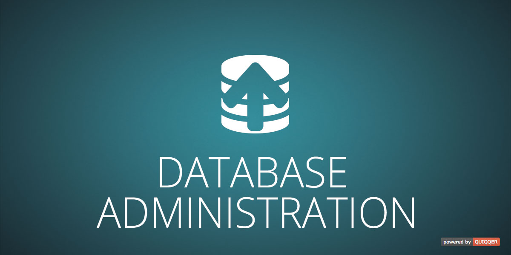

DataBase Administration
========

This module will extend your QUIQQER installation with a database administration.  
The database administration enables you to quickly edit your underlying database tables within the QUIQQER administrator panel.  
If you have to regurarely add or edit your database tables this module will save you enormous amounts of time and ease the process of maintaining your data.


Packagename:

    quiqqer/dbadmin


Features 
--------

* Edit tables within your QUIQQER administrator panel
* Show, edit and delete all tables and their data
* Works out of the box
* Automatic login with QUIQQERs configured database

Installation
------------

This module can be installed with composer.  

```bash
# Change into your composer directory within QUIQQER
cd var/composer

# Execute composers require command
php composer.phar require "quiqqer/dbadmin"
```


Contribute
----------

- Issue Tracker: https://dev.quiqqer.com/quiqqer/dbadmin/issues
- Source Code: https://dev.quiqqer.com/quiqqer/dbadmin


Support
-------

If you have encountered an error or if you want to suggest a new feature,  
feel free to send us an email to support@pcsg.de.


Lizence
-------
This module is licensed under the `GPL-3.0+` license.


